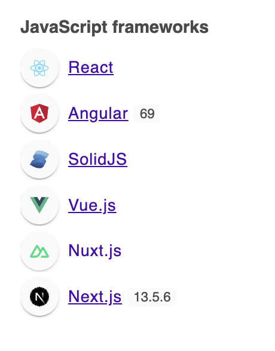

## Install

```shell

npm install devfools
yarn install devfools
pnpm install devfools
bun install devfools

```

## Usage

```ts
import devfools from 'devfools'

// or "antd" | "manoco" | "next" | "vite" | "vitepress" | "element" | "solid" | "react" | "nuxt" | "vue" | "svelte" | "angular" | "redux" | "motion" | "mobx" | "tailwind" | "naive" | "codemirror" | "all"
devfools('vue')
```

Or

```ts
devfools('all') // to enable all fake
```

Don't use it, it's just a joke. 🤡
