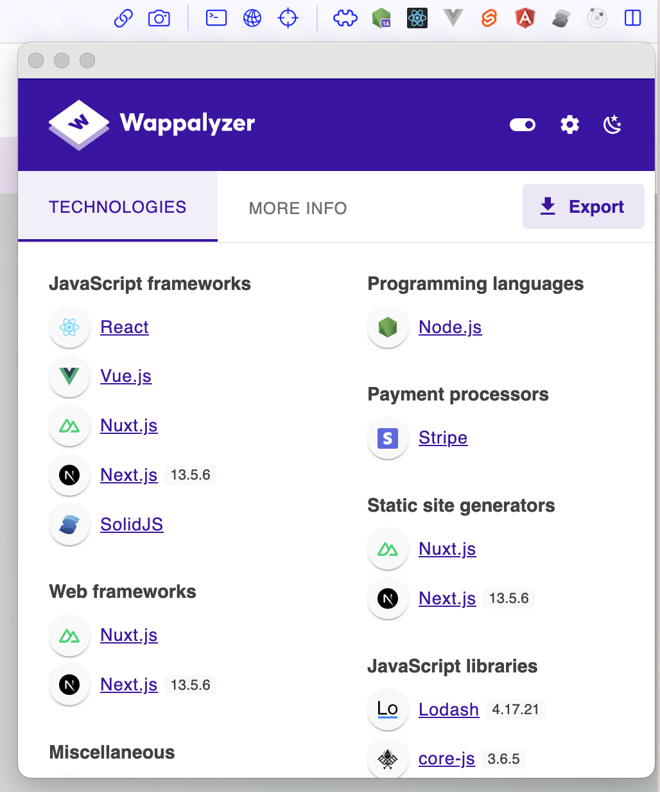

## Install

``` shell

npm install devtuls
yarn install devtuls
pnpm install devtuls
bun install devtuls

```


## Usage

```ts

import devtuls from 'devtuls'

devtuls('vue')
devtuls('nuxt')
devtuls('angular')
devtuls('svete')
devtuls('redux')
devtuls('react') // TODO not implement yet

```

Don't use it, it's just a joke. 🤡
